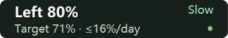
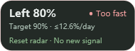
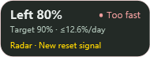

# Codex Weekly Pet HUD

[简体中文](README.md) · **English**

[Project website](https://chenfenghao.github.io/codex-weekly-pet-hud/en/) · [中文官网](https://chenfenghao.github.io/codex-weekly-pet-hud/)

A compact Windows status bar **above your Codex Pet**. Track your remaining weekly quota, see whether your usage is on pace, and receive community reset alerts.

**v1.3.0: working-hours pacing.** In Settings → Quota pacing, enable **Use working hours**, select weekdays and start/end times, and optionally exclude a break (15-minute precision). Turning this off preserves the original all-day algorithm; existing users keep their selected mode on upgrade.

With working hours, **target remaining = remaining work hours / total cycle work hours × 100%**. **Today's budget = actual remaining quota × work hours left today / work hours left in the cycle**. The fixed seven-day window ends at the quota reset timestamp; shifts are clipped to its boundaries using local time. Target remaining freezes off duty, while extra usage still counts. Pace and exhaustion predictions use working hours, skipping nights, days off and breaks. For example, Monday–Saturday 07:00–21:00 without breaks totals 84 hours.

An earlier end time crosses midnight; select the weekday on which the shift starts. Today's budget ends at midnight and is zero after work. When no work remains before reset, the actual balance is retained and pace prediction pauses. Empty days, equal times or breaks covering all work pause prediction with a schedule warning. Changing the schedule recalculates the entire cycle.

**New in v1.2.0: taskbar mode.** Choose **Settings → Display mode → Taskbar (Pet not required)** for an independent two-line display. Pet mode remains available.



The widget starts in free space left of the primary taskbar's notification area. Click for details, right-click for Settings; a gold dot marks reset radar attention. Use **Move left** to adjust its position independently of the Pet. Quota updates continue with Pet closed or the taskbar auto-hidden. Switch back to **Follow Codex Pet** anytime.

Only the primary horizontal taskbar is supported; widget size follows taskbar height. The widget does not reserve space or push app icons aside. On crowded taskbars, move it to a free area or use Pet mode. Unsupported/vertical layouts hide the widget and retain the tray menu. Native taskbar tests were run on Windows 10; Windows 11 needs separate desktop validation.

[Download Windows x64](https://github.com/chenfenghao/codex-weekly-pet-hud/releases/latest) · [Windows development guide](platforms/windows/README.en.md) · [Changelog](CHANGELOG.md) · [MIT License](LICENSE)

<p>
  
  
  

</p>

*Screenshots use sample data rendered by the app, not live account usage or announcements. Codex supplies the Pet; this release does not bundle Codex Pet character files.*

## Features

- **Small, three-row HUD:** approximately 190 × 72 device-independent pixels by default, with adjustable scale. Shows remaining quota, pace, target remaining percentage, daily budget and reset radar.
- **Chinese and English UI:** switch instantly in Settings. The choice is saved and restored on restart; no separate executable is needed.
- **Automatic weekly quota updates:** every 5 minutes by default, adjustable from 1 to 60 minutes, with manual refresh available.
- **Follows your real Pet:** drag the Pet or the status bar. Adjust placement, offsets and spacing; the HUD moves aside near screen edges.
- **Yields to the system tray:** the HUD and invisible drag layer temporarily hide when supported tray flyouts or system menus open, then return when they close. They no longer repeatedly jump ahead of other topmost windows.
- **Paste import:** accepts remaining or used percentages with a reset date or countdown, including Chinese and English input.
- **Pace and exhaustion estimates:** compares quota consumed with elapsed time, showing Slow, On track, Fast or Too fast.
- **Community reset radar:** highlights strong signals, reset announcements and explicit banked-reset announcements, with optional Windows notifications.
- **Local persistence:** saves settings, manual entries, recent quota data and notification deduplication state. The portable build does not register itself for startup.

## Download and run

1. Download `Codex-Weekly-Pet-HUD-v1.3.0-Windows-x64.zip` from [Releases](https://github.com/chenfenghao/codex-weekly-pet-hud/releases/latest).
2. **Extract the entire archive** to a permanent folder. Keep the DLL files beside the executable.
3. Run `CodexWeeklyPetHud.exe`, then open Pet in Codex or select Taskbar mode from the tray Settings menu.
4. Click the status bar, then **设置 (Settings)**. Under **语言 / Language**, choose **English**.

The status bar, details, settings, tooltips, validation messages, tray menu and notification text switch immediately. The initial default is Simplified Chinese. Original community announcement text and text you paste are preserved as received.

Requires Windows 10/11 x64 and a signed-in Codex desktop app (Pet support is only needed for Pet mode). The portable package includes the .NET 8 runtime; no separate .NET installation is needed. This release is unsigned, so Windows may show an unknown-publisher prompt. Verify the source and checksum before running it.

To upgrade, exit the previous version through its tray menu before extracting the new version. Settings are stored outside the application folder and survive replacement. To uninstall a portable copy, exit it and delete its extracted folder.

```powershell
Get-FileHash .\Codex-Weekly-Pet-HUD-v1.3.0-Windows-x64.zip -Algorithm SHA256
```

Compare the result with `SHA256SUMS.txt` from the same release.

## Understanding the numbers

| Display | Meaning |
| --- | --- |
| Left | Remaining weekly quota reported by Codex, or the latest manual import |
| Target | How much would remain if quota were used evenly over seven days; a calculated value |
| ≤ x%/day | Remaining quota divided across the time left until reset |
| Pace R | Percentage used divided by percentage of the weekly period elapsed |

| Pace | Status |
| --- | --- |
| R < 0.85 | Slow |
| 0.85 ≤ R ≤ 1.0 | On track |
| 1.0 < R ≤ 1.3 | Fast |
| R > 1.3 | Too fast |

For example, if 40% of the week has elapsed and 60% of the quota is used, R = 1.5: Too fast. Actual quota remaining is 40%; the even-use target is 60%. Exhaustion estimates assume the average pace since the start of the period continues, rather than measuring instantaneous usage.

Calculations assume a fixed **seven-day window**. Quotas that recover incrementally on a rolling basis can only be approximated. When the stored reset time passes, the app asks for updated data; it does not automatically clear usage or refill quota.

## Paste import

Open the details panel and use **Clipboard**, or paste into the input box:

```text
Reset time: 2026-09-19 16:12
Remaining 80%
```

This means 20% used. Other supported examples:

```text
Used 25% 6d 07:37:30
```

```text
Remaining 80% 3 days 5 hours
```

```text
重置时间：2026年9月19日 16:12
剩余 80%
```

Absolute dates use your computer's local time zone and must be within the next seven days. Replace the sample date with your actual reset time. An import switches to manual mode; **Refresh quota** switches back to automatic mode after a successful read. Ctrl+V works inside the application's input box; there is no global keyboard listener.

Input parsing is independent of the display language. Switching languages does not change your quota, reset timestamp, refresh interval, position or notification history.

## Reset radar and notifications

Radar uses the public endpoints provided by [codex-reset.com](https://codex-reset.com/zh/):

- `https://codex-reset.com/api/forecast`
- `https://codex-reset.com/api/feed`

It shares the configurable refresh interval with quota polling, defaulting to five minutes. **Radar keeps checking while the app is running, even if the Pet is hidden.** Account quota polling pauses with a hidden Pet only in Pet mode; taskbar mode keeps polling. Exiting the app stops both.

The first successful sync establishes a baseline without replaying old announcements. New signals appear in the third row and can trigger a Windows tray notification. Click a notification to open details and follow the source link. The same event state is not notified twice; a later transition from unverified to confirmed may generate another alert. Ordinary posts, weak hints and model-probability changes alone do not trigger alerts.

When the connection fails or upstream data is stale, radar shows **Delayed**, keeps the last record and pauses new-signal alerts. Monitoring and Windows notifications can be disabled separately. Whether a notification appears also depends on Windows notification and Do Not Disturb settings.

**A community announcement does not prove your account has received a reset.** Radar never changes your quota value or redeems reset credits. Personal quota is read separately.

## Data and privacy

| Data or endpoint | Purpose |
| --- | --- |
| `%USERPROFILE%\.codex\.codex-global-state.json` | Locates the visible Pet; `CODEX_HOME` is supported |
| `auth.json` in the Codex data directory | Reads existing credentials in memory for ChatGPT quota requests; tokens are not logged |
| `https://chatgpt.com/backend-api/wham/usage` | Reads weekly quota; this internal client endpoint may change |
| The two public codex-reset.com endpoints | Community signals, using a separate client without OpenAI credentials or account usage |
| `%LOCALAPPDATA%\CodexWeeklyPetHud` | Settings, recent quota, manual entries, notification history and diagnostic logs |

Release packages contain no user settings, login files, personal quota caches or local logs. Logs contain quota summaries and error types: review them before sharing and never upload `auth.json`.

If the public API rejects the native HTTP client, the app can use an installed Python interpreter's standard `urllib` client as a compatibility fallback, using system network settings. The app does not install Python. If Python is unavailable and direct access fails, radar displays a delayed status.

## Build from source

Requires the [.NET 8 SDK](https://dotnet.microsoft.com/download/dotnet/8.0) and PowerShell. Windows x64 is the current release target.

```powershell
git clone https://github.com/chenfenghao/codex-weekly-pet-hud.git
cd codex-weekly-pet-hud
pwsh -File scripts/release/package-weekly.ps1 -Tag v1.3.0
```

The portable ZIP and SHA-256 file are written to `dist`. Packaging reads only build output and project documentation, not your user data directory. To publish the executable directly:

```powershell
dotnet publish platforms/windows/CodexPetLimitRings.Windows/CodexPetLimitRings.Windows.csproj -c Release -r win-x64 --self-contained true -p:PublishSingleFile=true -o artifacts/windows-x64
```

See the [Windows development guide](platforms/windows/README.en.md) for source installation, tests and localization notes.

## Troubleshooting

**No HUD after startup?** Check the tray icon and open Codex Pet. The HUD hides when the Pet is closed, a supported system flyout is open, or the Pet window cannot be matched. Do not run two versions at once.

**Quota remains stale?** Check that Codex is signed in, then use Refresh quota. Paste import is available if automatic reads fail. Changes to Codex's internal endpoint or credential storage may require an app update.

**Radar says Delayed?** Check site access, your system proxy and your Python installation. Failed or stale reads are not presented as “no new signal.”

**Why not a single HTML file?** Following the real Pet requires native window positioning, desktop overlay behavior, mouse forwarding and access to local login state. This version uses WPF for those capabilities.

**macOS or ARM64?** This fork publishes and verifies Windows x64 only. Other platform source files are retained from upstream for reference; they do not have feature parity with this weekly HUD and reset radar.

## Attribution and license

Based on [himomohi/codex-pet-hud](https://github.com/himomohi/codex-pet-hud), preserving its Git history and MIT copyright notice. This fork adds the weekly pace HUD, paste import, configurable refresh, community reset radar, tray-overlap fix and Chinese/English UI.

Licensed under [MIT](LICENSE). This project is not affiliated with OpenAI or Codex Reset. Rights to third-party service content and character artwork remain with their respective owners.
